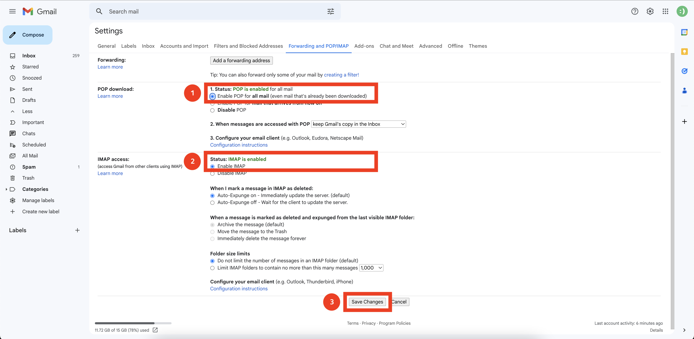
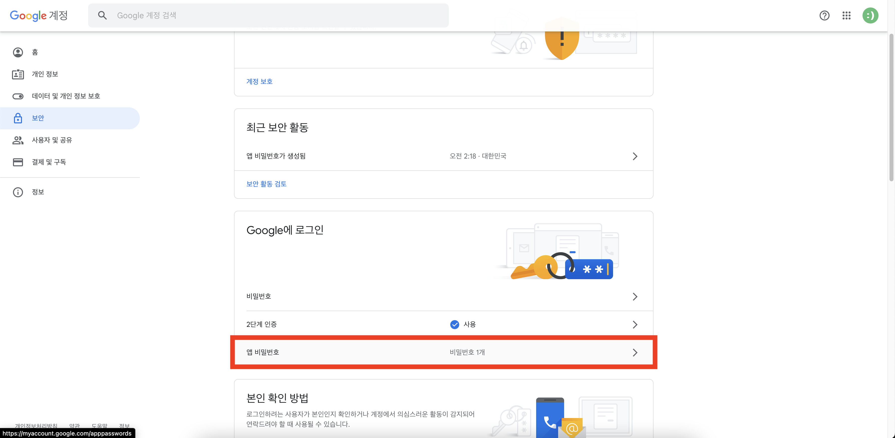
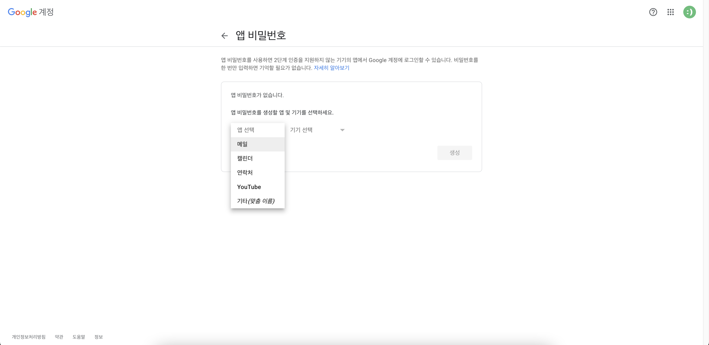
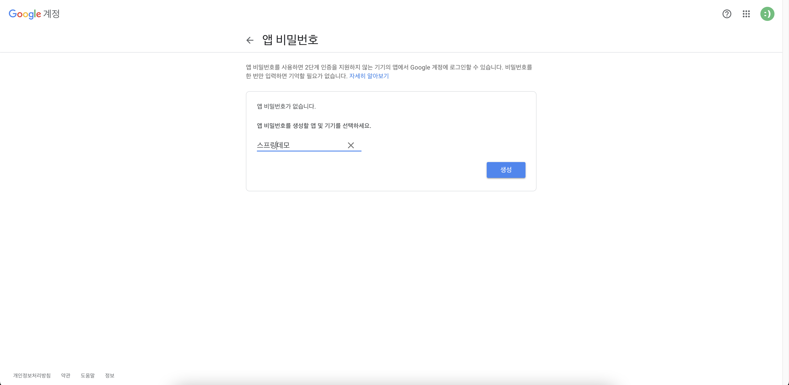
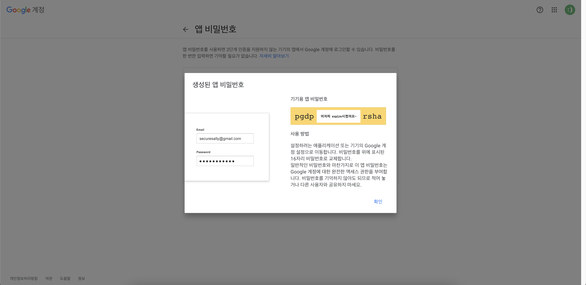

# 구글 이메일 발송하기

1. 메일 발송을 위한 계정 세팅 변경
    
2. 계정에 애플리케이션 접근을 위한 패스워드 생성
   
3. 메일을 선택
   
4. 기타를 선택
   
5. 패스워드에 이름을 작성
   
6. 패스워드를 복사
   
7. `Environment variables`에 다음과 같이 입력해주세요
   
   > ex. MAIL_USERNAME=test;MAIL_APPLICATION_PASSWORD=aaaabbbbccccdddd
